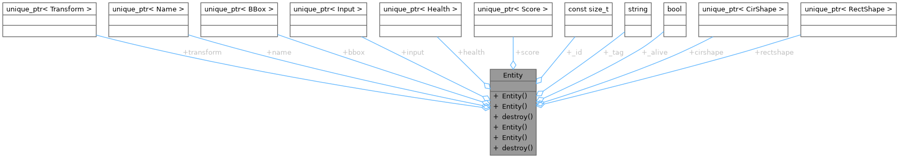

# ECS Design Pattern

ECS Design Pattern for Multiplayer Game Server
What is an ECS?
An Entity-Component-System (ECS) is a design pattern tailored for efficient handling of game entities, particularly in multiplayer environments like the one in this project. The ECS pattern emphasizes the separation of concerns, where game objects (entities) are composed dynamically from smaller reusable components, and the logic to manage them is encapsulated in systems.

In the context of our multiplayer game server, this separation becomes crucial for efficient management of different types of in-game entities such as players, enemies, missiles, and coins. Components are lightweight data containers that describe the attributes of these entities, such as position, health, or velocity. They do not contain behavior. The behavior is handled by systems like the MovementSystem, CollisionSystem, or ShootSystem, which process multiple entities based on the components they possess.

Entities in this setup are simply unique identifiers (IDs) that the server uses to track and update the game state. These IDs are associated with various components, depending on the entity's role in the game (e.g., players have position and health components, enemies have AI components, etc.).

Advantages of ECS in Our UDP-Based Game
Separation of Data and Logic: The ECS model decouples entity data from the systems that manipulate them, making it easier to scale and manage the game server. The server can efficiently manage thousands of entities, updating only the relevant components for each frame.

Optimized for Networked Environments: With UDP protocol, minimizing data sent between the server and clients is crucial. The ECS design enables efficient synchronization by updating only the necessary components, reducing redundant information. For instance, only position, velocity, and entity state changes are transmitted, cutting down on unnecessary network traffic.

Dynamic Composition: The game allows for dynamic interactions such as creating rooms, joining sessions, and tracking the state of entities like players, enemies, and missiles. ECS provides the flexibility to dynamically add or remove components from entities as the game progresses, enabling features like entity spawning, destruction, or state changes (e.g., player death, missile firing).

Ressources : COMP4300 - Game Programming by Dave Churchill --> https://www.youtube.com/@DaveChurchill

### CPU Cache Optimization for Real-Time Multiplayer

Given the real-time nature of the game and the need to handle multiple clients via UDP, optimizing memory access is key. The ECS pattern is highly cache-friendly. By organizing components of the same type in contiguous memory, we ensure that the CPU can access and update multiple components without frequent cache misses. This significantly improves the server's ability to process multiple entities (players, enemies, etc.) within the constraints of the frame rate, ensuring smooth gameplay.

The server fetches components into cache lines in bulk, which is particularly important when handling entity positions, velocities, or network packets. This reduces the latency between receiving input from clients and broadcasting updated game states back to them.

In this game server, systems like movement, collision detection, and shooting benefit from cache-efficient designs, improving the overall responsiveness and minimizing lag during gameplay.

