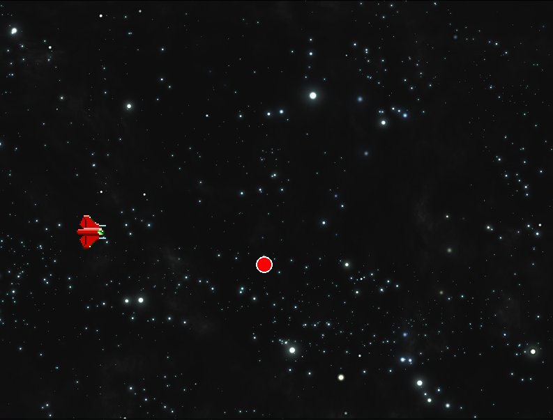

# R-Type Game Engine Documentation

## Overview

The R-Type Game Engine is a comprehensive C++ framework built on top of SFML (Simple and Fast Multimedia Library). It provides a set of modular components to facilitate game development, including animation handling, audio management, image rendering, input processing, mouse interaction, parallax scrolling, and shape drawing.

## Engine Structure

The engine is organized into the following modules:

## Modules

### 1. Animation

The Animation module handles sprite animations.

**Key Features:**
- Load and manage multiple animations
- Update and render animations
- Control animation scale and position
- Move animations in different directions

**Usage Example:**
```cpp
Animation anim;
anim.loadAnimation("player_run", 8);
anim.update("player_run");
anim.render(window, "player_run");
```

### 2. Audio

The AudioManager handles sound effects and music playback.

**Key Features:**
- Play sound effects and music
- Pause and resume music
- Adjust volume for music and sound effects
- Control sound pitch

**Usage Example:**
```cpp
AudioManager audio;
audio.playSound("explosion.wav");
audio.playMusic("background_music.ogg");
audio.setMusicVolume(75);
```

### 3. Image

The ImageManager handles loading, manipulating, and rendering images.

**Key Features:**
- Load images from files
- Set image position and scale
- Draw images to the render window
- Get image boundaries for collision detection

**Usage Example:**
```cpp
ImageManager image;
image.createImage("sprite.png");
image.setPosition(100, 100);
image.draw(window);
```

### 4. Input

The InputManager processes keyboard input and window events.

**Key Features:**
- Handle key presses and releases
- Track states of specific control buttons
- Process window-related events

**Usage Example:**
```cpp
InputManager input;
input.handleInput(event, window);
if (input.getButton().left) {
    // Move player left
}
```

### 5. Mouse

The MouseManager tracks mouse position and interactions.

**Key Features:**
- Update mouse position relative to the window
- Retrieve current mouse coordinates

**Usage Example:**
```cpp
MouseManager mouse;
mouse.handleMousePosition(window);
float mouseX = mouse.getMouseX();
float mouseY = mouse.getMouseY();
```

### 6. Parallax

The Parallax module creates scrolling background effects.

**Key Features:**
- Create parallax scrolling with two layers
- Update parallax based on time
- Draw parallax backgrounds

**Usage Example:**
```cpp
Parallax bg("far_bg.png", "near_bg.png", 50, 100);
bg.update(deltaTime);
bg.draw(window);
```

### 7. Shape

The ShapeManager provides utilities for drawing geometric shapes.

**Key Features:**
- Draw rectangles with customizable properties
- Draw circles with customizable properties

**Usage Example:**
```cpp
ShapeManager shapes;
shapes.drawRectangle(window, 50, 50, 100, 100, sf::Color::Red, 2);
shapes.drawCircle(window, 200, 200, 50, sf::Color::Blue, 1);
```

## Getting Started

1. Include the necessary headers in your project.
2. Initialize SFML and create a render window.
3. Create instances of the required managers (AudioManager, InputManager, etc.).
4. In your game loop:
   - Handle events using InputManager
   - Update game logic
   - Update animations and parallax effects
   - Clear the window
   - Draw your game objects using the various managers
   - Display the window

## Best Practices

1. Use const references for SFML objects passed to functions to avoid unnecessary copying.
2. Implement error handling for resource loading (images, sounds, etc.).
3. Use the singleton pattern for managers that should have only one instance (e.g., AudioManager).
4. Optimize your draw calls by batching similar draw operations.

# Code Example and Result

## Code

Certainly! Here's a comprehensive example that demonstrates the usage of all the classes within an SFML window. This example creates a simple scene with a moving character, background music, a parallax background, and some interactive elements.

```cpp
#include <SFML/Graphics.hpp>
#include "include/Engine/Animation/Animation.hpp"
#include "include/Engine/Audio/AudioManager.hpp"
#include "include/Engine/Image/ImageManager.hpp"
#include "include/Engine/Input/InputManager.hpp"
#include "include/Engine/Mouse/MouseManager.hpp"
#include "include/Engine/Parallax/parallax.hpp"
#include "include/Engine/Shape/ShapeManager.hpp"

int main()
{
    // Create the main window
    sf::RenderWindow window(sf::VideoMode(800, 600), "R-Type Game Engine Demo");
    window.setFramerateLimit(60);

    // Initialize managers
    Animation animation;
    AudioManager audio;
    ImageManager backgroundImage;
    InputManager input;
    MouseManager mouse;
    Parallax parallax("assets/image/Background/background1.png", "assets/image/Background/background2.png", 30, 60);
    ShapeManager shapes;

    // Load character animation
    animation.loadAnimation("red", 8);  // Assuming 8 frames for running animation
    animation.setScale(2.0f, 2.0f);
    animation.setPosition("red", 400, 300);

    // Load background image
    backgroundImage.createImage("assets/background.png");
    backgroundImage.fitToScreen(800, 600);

    // Load and play background music
    audio.playMusic("assets/audio/Effect/boom.ogg");
    audio.setMusicVolume(50);

    // Main game loop
    while (window.isOpen())
    {
        sf::Event event;
        while (window.pollEvent(event))
        {
            input.handleInput(event, window);
            if (event.type == sf::Event::Closed)
                window.close();
        }

        // Update mouse position
        mouse.handleMousePosition(window);

        // Handle character movement
        if (input.getButton().left)
            animation.moveXLeft("red", 5.0f);
        if (input.getButton().right)
            animation.moveXRight("red", 5.0f);
        if (input.getButton().up)
            animation.moveYUp("red", 5.0f);
        if (input.getButton().down)
            animation.moveY("red", 5.0f);

        // Play a sound effect when attacking
        if (input.getButton().attack)
            audio.playSound("assets/attack_sound.wav");

        // Update parallax and animation
        parallax.update(0.016f);  // Assuming 60 FPS, so delta time is approximately 1/60
        animation.update("red");

        // Clear the window
        window.clear();

        // Draw the background
        backgroundImage.draw(window);

        // Draw parallax background
        parallax.draw(window);

        // Draw character animation
        animation.render(window, "red");

        // Draw a shape at the mouse position
        shapes.drawCircle(window, mouse.getMouseX(), mouse.getMouseY(), 10, sf::Color::Red, 2);

        // Draw a rectangle
        shapes.drawRectangle(window, 50, 50, 100, 100, sf::Color::Green, 2);

        // Display everything on screen
        window.display();
    }

    return 0;
}
```

## Demo



This example demonstrates:

1. Creating an SFML window
2. Initializing all the manager classes
3. Loading and displaying a character animation
4. Playing background music
5. Handling user input for character movement
6. Updating and rendering a parallax background
7. Using the mouse position to draw a shape
8. Drawing additional shapes on the screen

To run this example, you'll need to:

1. Have all the necessary header files in their respective directories
2. Have the SFML library properly linked to your project
3. Provide the necessary asset files (images, music, sound effects) in an "assets" directory

This code provides a starting point that you can expand upon to create more complex games using the R-Type Game Engine components. You can add game-specific logic, more complex animations, additional audio cues, and more sophisticated input handling as needed for your game.


## Conclusion

The R-Type Game Engine provides a solid foundation for building 2D games with SFML. By utilizing these modules, developers can focus on game-specific logic while leveraging the engine's capabilities for common game development tasks.